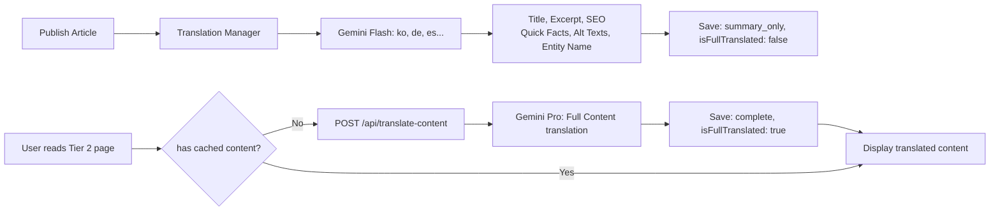

# 🌐 Translation Strategy Blueprint — Siam Heritage

> **15 ภาษา · 2 Tiers · Cultural Localization · Cost-Optimized**
> Next.js 15.3 · Gemini 2.0 Flash/Pro · File-based Cache · Race Condition Protection

---

## 📑 สารบัญ

1. [Overview](#overview)
2. [Tier Architecture](#tier-architecture)
3. [File Map](#file-map)
4. [Translation Flow](#translation-flow)
5. [Cultural Localization Rules](#cultural-localization-rules)
6. [Cost Optimization Strategy](#cost-optimization-strategy)
7. [Race Condition Protection](#race-condition-protection)
8. [Admin Dashboard](#admin-dashboard)
9. [API Reference](#api-reference)
10. [Migration Guide (v1 → v2)](#migration-guide-v1--v2)

---

## Overview

Translation Strategy นี้ถูกออกแบบมาเพื่อให้เว็บไซต์ siamheritage.org สามารถ:

- **รองรับ 15 ภาษา** ตั้งแต่วันแรกที่ publish
- **ประหยัดค่าใช้จ่าย API** โดยแบ่งภาษาตามความสำคัญ (Tier)
- **SEO Full Support** สำหรับทุกภาษา (JSON-LD + meta tags)
- **Cultural Localization** — คำเฉพาะทางไทยต้องแปลแบบมีบริบท
- **JIT (Just-in-Time)** — แปลเนื้อหาเมื่อมีคนอ่านครั้งแรก
- **Race Condition Protection** — ป้องกันยิง API ซ้ำเมื่อมีคนเปิดพร้อมกัน

### ภาษา 15 ภาษา

| Tier | ภาษา | พฤติกรรมการแปล |
|------|------|----------------|
| **Tier 1** (5 ภาษา) | th(ต้นฉบับ), en, zh, ja, fr | Full translate ทันที — ทุก字段 (title, excerpt, content, SEO, Quick Facts, alt texts, entity name) |
| **Tier 2** (10 ภาษา) | ko, de, es, pt, ru, ar, hi, it, vi, ms | Summary translate ก่อน (title, excerpt, SEO, Quick Facts, alt texts, entity name) → Content JIT เมื่อมีคนอ่านครั้งแรก |

### หลักการ Cost-Optimization

```
1 บทความ → Pre-translate 14 ภาษา
├── Tier 1 (4 ภาษา): 4 API calls × Flash   = ~$0.012
├── Tier 2 (10 ภาษา): 50 API calls × Flash  = ~$0.008 (summary + localizations)
└── Total pre-translate:                     = ~$0.02
    └── JIT Content (Tier 2): 10 × Pro      = ~$0.04 (เมื่อมีคนอ่านครั้งแรก)
```

---

## Tier Architecture

### Tier 1 — Full Translate (Pre-translate ทันที)

```mermaid
flowchart LR
    A[Publish Article] --> B[Translation Manager]
    B --> C1[Gemini Flash: en]
    B --> C2[Gemini Flash: zh]
    B --> C3[Gemini Flash: ja]
    B --> C4[Gemini Flash: fr]
    C1 --> D1[Title, Excerpt, Content, SEO<br>Quick Facts, Alt Texts, Entity Name]
    C2 --> D2
    C3 --> D3
    C4 --> D4
    D1 --> E[Save to translations/{slug}/{locale}.json<br>status: complete, isFullTranslated: true]
```

**สิ่งที่แปลใน Tier 1 (ทุก字段):**
- `title` — ชื่อบทความ
- `shortExcerpt` — ≤150 chars (สำหรับ card + meta)
- `longExcerpt` — 250-400 chars (lead paragraph)
- `content` — เนื้อหาหลักทั้งบทความ (markdown preserved)
- `seoTitle` — ≤60 chars
- `seoDescription` — ≤160 chars
- `socialCaption` — สำหรับ copy to clipboard
- `quickFacts[]` — แต่ละ field → localized label + culturally-localized value
- `imageAltTexts{}` — alt text ทุกรูป
- `entityName` — ชื่อ Entity + คำอธิบายสั้น
- `localizedKeywords[]` — tags ที่ localize แล้ว

### Tier 2 — Summary + JIT Content



**สิ่งที่แปลล่วงหน้าใน Tier 2:**
- `title` — ชื่อบทความ
- `shortExcerpt` — ≤150 chars
- `longExcerpt` — 250-400 chars
- `seoTitle` + `seoDescription`
- `socialCaption`
- `quickFacts[]` — localized
- `imageAltTexts{}` — localized
- `entityName` — localized

**สิ่งที่แปล JIT เมื่อมีคนอ่าน:**
- `content` — เนื้อหาหลัก (ใช้ Gemini Pro)

---

## File Map

### Core Translation Files

| File | Server/Client | คำอธิบาย |
|------|---------------|----------|
| `lib/locales.ts` | Both | ALL_LOCALES, TIER1_LOCALES, TIER2_LOCALES, Locale type, isTier1(), isTier2() |
| `lib/types.ts` | Both | `TranslatedArticle`, `TranslatedQuickFact`, `TranslationStrategyConfig`, `TranslationTask` |
| `lib/translation-store.ts` | ⚠️ **Server only** | File-based cache (JSON files), lock system, read/write |
| `lib/translation-client-store.ts` | Client only | `checkNeedsFullTranslation()`, `fetchContentTranslation()` |

### Translation Engine

| File | Server/Client | คำอธิบาย |
|------|---------------|----------|
| `lib/gemini-service.ts` | Server | Raw Gemini API calls: `translateArticle()`, `translateContentOnly()`, `buildGeminiSystemPrompt()` |
| `lib/translate-service.ts` | Server | Re-export wrapper (backward compat) |
| `lib/translation-manager.ts` | ⚠️ **Server only** | **NEW** — Central orchestrator: `preTranslateArticle()`, `jitTranslateContent()`, `localizeQuickFacts()`, `localizeExcerpts()`, `localizeImageAlts()`, `localizeEntityName()` |
| `lib/cultural-localization-prompt.ts` | Server | **NEW** — Prompt builders: `buildQuickFactsLocalizationPrompt()`, `buildExcerptLocalizationPrompt()`, `buildImageAltLocalizationPrompt()`, `buildEntityNamePrompt()` |

### API Routes

| Route | Method | คำอธิบาย |
|-------|--------|----------|
| `/api/translate-new` | POST | Trigger pre-translate สำหรับ 14 ภาษา (รองรับ `dryRun`) |
| `/api/translate-content/[slug]` | POST | JIT content translation (Tier 2 → first read) |

### Admin UI

| Page | คำอธิบาย |
|------|----------|
| `app/admin/translations/page.tsx` | **NEW Dashboard** — แสดงสถานะทุกบทความ, Trigger แปล, Dry Run cost estimate |

---

## Translation Flow (Sequence Diagram)

```
Admin Publish Article
    │
    ▼
POST /api/translate-new { slug, dryRun?: true }
    │
    ├── dryRun=true ───► return CostEstimate (ไม่ยิง API จริง)
    │
    └── dryRun=false ──► preTranslateArticle(master, wikiMetadata)
                            │
                            ├── TIER 1 (en, zh, ja, fr)
                            │   └── translateArticle(locale, {full content}) → Gemini Flash
                            │       ├── title, excerpt, content, seoTitle, seoDescription
                            │       └── saveTranslatedArticle → translations/{slug}/{locale}.json
                            │
                            └── TIER 2 (ko, de, es, pt, ru, ar, hi, it, vi, ms)
                                ├── translateArticle(locale, {summary}) → Gemini Flash
                                │   └── title, excerpt, seoTitle, seoDescription
                                ├── localizeQuickFacts(locale) → Gemini Flash
                                │   └── buildQuickFactsLocalizationPrompt() → array of localized key-values
                                ├── localizeExcerpts(locale) → Gemini Flash
                                │   └── buildExcerptLocalizationPrompt() → shortExcerpt, longExcerpt, socialCaption
                                ├── localizeImageAlts(locale) → Gemini Flash
                                │   └── buildImageAltLocalizationPrompt() → localized alt texts
                                ├── localizeEntityName(locale) → Gemini Flash
                                │   └── buildEntityNamePrompt() → localized entity name
                                └── saveTranslatedArticle → translations/{slug}/{locale}.json
                                    (isFullTranslated: false, content: "")

User reads Tier 2 article (first time)
    │
    ▼
POST /api/translate-content/{slug} { locale }
    │
    ├── checkFullTranslationStatus() → "summary_only"
    ├── acquireTranslationLock() → lock file
    ├── jitTranslateContent(slug, locale, originalContent)
    │   └── translateContentOnly(locale, content) → Gemini Pro
    │       └── saveTranslatedArticle → update content + isFullTranslated: true
    └── releaseTranslationLock()
    │
    ▼
Display translated content to user
Next user → reads from cache immediately
```

---

## Gemini Prompt Design (New — 2025)

### หลักการออกแบบ Prompt

Separate prompts for **2 distinct tasks**, each optimized for its purpose:

| Prompt | สำหรับ | API Model |
|--------|--------|-----------|
| **Content Prompt** | Title, ShortExcerpt, LongExcerpt, Content | Flash (Tier 1), Pro (JIT Tier 2) |
| **Structured Data Prompt** | Glossary, Quick Facts, Entity Values | Flash (always — low complexity) |

### 1. Content Prompt (`buildContentSystemPrompt`)

```text
You are an expert translator and cultural mediator specializing in Thai heritage,
arts, and history for the "Siam Heritage" encyclopedia project.
Your task is to translate the provided Thai content into the target language
specified in the variable: [TARGET_LANGUAGE].

### Translation Guidelines:
1. **Tone & Style:** Maintain an encyclopedic, respectful, and engaging tone
   appropriate for a cultural heritage platform.
2. **Natural Flow:** Avoid literal word-for-word translation. Prioritize the
   natural idiom, syntax, and flow of the [TARGET_LANGUAGE] while preserving
   the original historical and cultural context accurately.
3. **Cultural Terms:** For specific Thai cultural terms (e.g., ประเพณีลอยกระทง,
   ศาลา, เครื่องถม), use the accepted international term, transliterate with
   a brief explanation, or use the closest cultural equivalent that makes sense
   to a native speaker of [TARGET_LANGUAGE].
4. **Consistency:** Ensure the tone is consistent across the Title, Excerpt,
   and Full Content.

### Input Data (JSON format):
{
  "title": "[THAI_TITLE]",
  "short_excerpt": "[THAI_SHORT_EXCERPT]",
  "long_excerpt": "[THAI_LONG_EXCERPT]",
  "content": "[THAI_FULL_CONTENT]"
}

### Expected Output:
Return ONLY a valid JSON object matching the input structure, translated into
[TARGET_LANGUAGE]. Do not include any markdown formatting (like ```json) or
extra text outside the JSON.
{
  "title": "...",
  "short_excerpt": "...",
  "long_excerpt": "...",
  "content": "..."
}
```

**Key changes from old prompt:**
- แยก `short_excerpt` (≤150 chars) และ `long_excerpt` (250-400 chars) แทน `excerpt` เดิม
- ลบ SEO fields (`seoTitle`, `seoDescription`) — จัดการแยกต่างหาก
- ใช้ `[TARGET_LANGUAGE]` variable แทน `${targetLanguage}` — Gemini เข้าใจชื่อภาษาอังกฤษ
- บังคับ `response_mime_type: "application/json"` เพื่อให้ JSON เสถียร

### 2. Structured Data Prompt (`buildStructuredDataSystemPrompt`)

```text
You are a precise data localization engine for the "Siam Heritage" encyclopedia.
Your task is to translate and localize structured data from Thai into
[TARGET_LANGUAGE].

### Strict Instructions for Structured Data:
1. **JSON Keys:** NEVER translate or modify the JSON keys or Entity identifiers.
   Translate ONLY the values.
2. **Glossary Terms:** Translate technical cultural terms, historical eras
   (e.g., อยุธยา, รัตนโกสินทร์), and proper nouns using globally recognized
   historical standards in [TARGET_LANGUAGE]. Do not attempt to visually
   translate or create new terms.
3. **Quick Facts:** Keep the translated facts concise, sharp, and factually
   accurate. Ensure units or formatting (e.g., dates, eras) align with the
   standards of [TARGET_LANGUAGE].
4. **No Hallucinations:** If a cultural term has a strict official translation
   (e.g., Royal Institute of Thailand standard), use it. Do not add descriptive
   fluff to the values.

### Input Data (JSON format):
{
  "glossary": [
    { "term": "THAI_TERM_1", "context": "CONTEXT_OR_DEFINITION_1" },
    { "term": "THAI_TERM_2", "context": "CONTEXT_OR_DEFINITION_2" }
  ],
  "quick_facts": {
    "fact_key_1": "THAI_VALUE_1",
    "fact_key_2": "THAI_VALUE_2"
  },
  "entity_values": {
    "entity_key_1": "THAI_VALUE_3",
    "entity_key_2": "THAI_VALUE_4"
  }
}

### Expected Output:
Return ONLY the translated JSON structure. Keep keys exactly as they are in
the input. Translate only the values and term definitions into
[TARGET_LANGUAGE]. No conversational text or markdown wrappers.
```

### 3. การส่งค่า [TARGET_LANGUAGE] Variable

ใน `lib/gemini-service.ts`:

```typescript
function getTargetLanguage(locale: Locale): string {
  // ใช้ชื่อภาษาภาษาอังกฤษที่ Gemini เข้าใจ
  // เช่น "English", "Simplified Chinese", "Japanese", "French"
  return LOCALE_NAMES[locale]?.english || "English";
}
```

**ข้อดี:** Gemini รู้จักชื่อภาษาเหล่านี้ และปรับโหมดการพิมพ์ (中日韓 / Latin) ได้อย่างถูกต้อง

### 4. การบังคับ JSON Output ที่เสถียร

ตั้งค่า `response_mime_type: "application/json"` ใน `generationConfig`:

```typescript
generationConfig: {
  temperature: 0.3,
  topP: 0.95,
  topK: 40,
  maxOutputTokens: 8192,
  response_mime_type: "application/json",  // ← KEY: บังคับ JSON output
}
```

**ข้อดีเมื่อใช้ `response_mime_type: "application/json"`:**
- Gemini คาย JSON โดยตรง — ไม่มี markdown wrapping (```json)
- ไม่ต้องใช้ regex `match(/\{[\s\S]*\}/)` เพื่อ extract JSON
- ลด parse error ได้มาก
- ยังมี fallback regex เผื่อไว้ใน code

### 5. การแยก Content กับ Structured Data

```
Publish Article
    │
    ├── translateArticleContent() ──→ Content Prompt
    │   └── title, short_excerpt, long_excerpt, content
    │
    └── translateStructuredData() ──→ Structured Data Prompt
        └── glossary[], quick_facts{}, entity_values{}
```

**เหตุผลที่แยก:**
1. **Cost Optimization:** Structured Data = ง่าย → ใช้ Flash เสมอ
2. **Focus:** Content Prompt ไม่ต้องกังวลเรื่อง JSON keys, Structured Data Prompt ไม่ต้องกังวลเรื่องเนื้อหายาว
3. **Maintainability:** แก้ prompt แต่ละอันได้โดยไม่กระทบอีกอัน

### 6. Entity Name — ไม่ต้องกรอก EN ใน admin

Entity Name (EN) ถูกลบออกจาก Entity Facts Manager เพราะ Gemini แปลให้อัตโนมัติ:

```
ส่ง entityName ภาษาไทยไป → Gemini แปล → เก็บ entity_name ใน translations table
```

**ข้อมูลที่ Gemini ได้รับ:**
```json
{
  "entity_values": {
    "entity_name": "โขนไทย"
  }
}
```

**ผลลัพธ์ที่ได้กลับ:**
```json
{
  "entity_values": {
    "entity_name": "Khon (Thai Masked Dance Drama)"
  }
}
```

### 7. Legacy Backward Compatibility

ฟังก์ชัน `translateArticle()` (legacy) ยังคงอยู่ — map ไปยัง `translateArticleContent()`:
```typescript
export async function translateArticle(
  targetLocale: Locale,
  options: { title, excerpt, content, includeFullContent, isTier2Lazy? }
): Promise<{ title, excerpt, content? }> {
  const result = await translateArticleContent(targetLocale, {
    title,
    shortExcerpt: excerpt,
    longExcerpt: excerpt,
    content,
    includeFullContent,
  });
  return {
    title: result.title,
    excerpt: result.short_excerpt || result.long_excerpt || excerpt,
    content: result.content,
  };
}
```

---

## Cultural Localization Rules

### กฎเหล็กการแปลคำเฉพาะทางวัฒนธรรม

เมื่อ Gemini พบคำที่เป็น **คำเฉพาะทางวัฒนธรรมไทย** ใน Quick Facts, Excerpt, Entity Name หรือ Alt Text ต้องแปลตามกฎต่อไปนี้:

#### Rule 1: Transliteration + Context

```
FORMAT: [transliteration] ([brief definition/context in target language])

ตัวอย่าง (EN):
  "บรมพิมาน"       → "Boromphiman (A formal Thai national costume style)"
  "มงคล"           → "Mongkhon (A sacred Thai boxer's headband)"
  "ผ้าซิ่นตีนจก"   → "Pha Sin Tin Jok (A traditional Thai ikat-patterned sarong)"
  "ประเจียด"       → "Prajied (A sacred armband worn by Muay Thai fighters)"
  "รามเกียรติ์"     → "Ramakien (Thailand's national epic adapted from the Ramayana)"
  "กระบี่กระบอง"   → "Krabi Krabong (Thai ancient weapon-based martial art)"
  "หนังใหญ่"       → "Nang Yai (Thai traditional shadow puppetry)"
  "ปี่พาทย์"       → "Pi Phat (Thai classical percussion and wind ensemble)"

ตัวอย่าง (ZH — Chinese):
  "โขน"           → "孔剧 (Kong ju, Thai traditional masked dance drama)"
  "รามเกียรติ์"     → "拉玛坚 (La ma jian, Thai epic adapted from Ramayana)"

ตัวอย่าง (JA — Japanese):
  "โขน"           → "コーン (Khon, タイの伝統的な仮面舞踊劇)"
```

#### Rule 2: Do NOT translate JSON structure keys

```json
// ❌ WRONG: AI translated the key names
{
  "ชื่อฟิลด์": "วัฒนธรรม",
  "ค่า": "ข้อมูล"
}

// ✅ CORRECT: Only translate the content values
{
  "label": "Cultural Roots",
  "value": "Chak Nak Duek Dam Ban (Ancient Thai puppetry tradition)"
}
```

#### Rule 3: Date/Calendar Adaptation

```
"พ.ศ. 2561 (ค.ศ. 2018)" → "2018 CE" (EN), "公元2018年" (ZH)
"รัชกาลที่ 1" → "King Rama I" (EN), "拉玛一世" (ZH)
```

#### Rule 4: UNESCO Terminology

ใช้คำศัพท์ทางการของ UNESCO:
```
"Representative List of the Intangible Cultural Heritage of Humanity"
"代表名录" (ZH)
"代表一覧表" (JA)
```

### How to implement in code

```typescript
import { buildQuickFactsLocalizationPrompt } from "@/lib/cultural-localization-prompt";

// ใน translation-manager.ts
const prompt = buildQuickFactsLocalizationPrompt(
  "en",          // target locale
  "โขนไทย",      // entity name
  wikiMetadata.quickFacts  // array of QuickFact
);

// ส่ง prompt ให้ Gemini Flash
const result = await callWithCustomPrompt(prompt, "en");
// result = [{"key":"Cultural Roots","value":"Chak Nak Duek Dam Ban (Ancient Thai puppetry tradition)"}, ...]
```

---

## Cost Optimization Strategy

### Gemini Model Selection

| Task | Model | Cost/1K input | Cost/1K output |
|------|-------|---------------|----------------|
| Tier 1 Full Content | Gemini 2.0 Flash 🚀 | $0.00015 | $0.00060 |
| Tier 2 Summary | Gemini 2.0 Flash 🚀 | $0.00015 | $0.00060 |
| Tier 2 JIT Content | Gemini 2.0 Pro 🎯 | $0.00350 | $0.01050 |
| Cultural Localization | Gemini 2.0 Flash 🚀 | $0.00015 | $0.00060 |

### Cost per Article

| Step | Locales | API Calls | Model | Estimated Cost |
|------|---------|-----------|-------|----------------|
| Tier 1 Full | 4 (en, zh, ja, fr) | 4 | Flash | ~$0.012 |
| Tier 2 Summary | 10 | 10 | Flash | ~$0.002 |
| Tier 2 Quick Facts | 10 | 10 | Flash | ~$0.001 |
| Tier 2 Excerpts | 10 | 10 | Flash | ~$0.001 |
| Tier 2 Alt Texts | 10 | 10 | Flash | ~$0.001 |
| Tier 2 Entity Names | 10 | 10 | Flash | ~$0.001 |
| **Pre-translate Total** | **14** | **~54** | **Flash** | **~$0.018** |
| Tier 2 JIT Content | 10 (first read) | 10 | Pro | ~$0.04 |
| **Grand Total (all read)** | **14** | **64** | **Mix** | **~$0.058** |

### Real-World Estimation

```
100 บทความ:
  Pre-translate: 100 × $0.018 = $1.80
  JIT Content (50% read): 500 × $0.04 = $2.00
  Monthly Total: ~$3.80

500 บทความ:
  Pre-translate: 500 × $0.018 = $9.00
  JIT Content (30% read): 1,500 × $0.04 = $6.00
  Monthly Total: ~$15.00
```

### Saving Tips

1. **Dry Run ก่อนแปลจริง** — ใช้ `dryRun=true` ดู cost estimate
2. **Batch Pre-translate** — แปลหลายบทความพร้อมกัน (rate limit 500ms ระหว่าง locale)
3. **Cache JIT Results** — เมื่อแปล content เสร็จ เก็บทันที → คนต่อไปได้ฟรี
4. **Retry with Backoff** — Exponential backoff (1s, 2s) ถ้า API ล้ม
5. **Fallback to Original** — ถ้า JIT ล้มเหลว ให้ใช้ content ต้นฉบับไทยแทน

---

## Race Condition Protection

### ปัญหา: มี User 2 คนเปิด Tier 2 locale พร้อมกัน

```
User A ───► POST /api/translate-content/khon { locale: "ko" }
                                   │
User B ───► POST /api/translate-content/khon { locale: "ko" }  (0.1s later)
                                   │
                           ❌ 2× API calls → เสียเงินฟรี!
```

### วิธีป้องกันใน `translation-store.ts`

```typescript
// 1. Lock System: file-based semaphore
const lockPath = translations/khon/.lock.ko.lock

// 2. ถ้ามี lock และอายุ < 30s → skip
if (exists(lockPath) && (now - mtime) < 30000) return false;

// 3. ถ้า lock หมดอายุ (stale) → ลบแล้วสร้างใหม่
if (exists(lockPath) && (now - mtime) >= 30000) unlink(lockPath);

// 4. สร้าง lock → แปล → อัปเดต cache → release lock
writeFile(lockPath, { pid, acquiredAt });
translateContentOnly(locale, content);
saveTranslatedArticle(slug, locale, updated);
unlink(lockPath);
```

### Flow Diagram

```
Request A arrives ──► acquireTranslationLock() ──► ✅ Got lock! ──► Translating...
                                                              │
Request B arrives ──► acquireTranslationLock() ──► ❌ Lock held ──► Return { translatingInProgress: true }
                                                              │
Request A done ──► releaseTranslationLock() ──► Cache updated
                                                              │
Request C arrives ──► checkFullTranslationStatus() ──► ✅ Fully translated!
                                                              │
                                                              └──► Return cached content
```

---

## Admin Dashboard

### URL: `/admin/translations`

#### Features

1. **Article List** — แสดงทุกบทความที่มีสถานะ "published"
2. **Language Status Grid** — 15 ภาษา ต่อ 1 บทความ (Full/Summary/Pending)
3. **Dry Run Button** (👁️) — ดู cost estimate ก่อนแปลจริง
4. **Translate Button** (▶️) — Trigger pre-translate สำหรับ 14 ภาษา
5. **Expand/Collapse** — ดูรายละเอียดแต่ละภาษา
6. **Search** — ค้นหาบทความ
7. **UI Translation Tab** — สำหรับข้อความส่วน UI (nav, footer, etc.)

#### Screenshot

```
┌──────────────────────────────────────────────────────────────┐
│  🌐 Translation Manager                                     │
│  จัดการระบบแปลภาษา 15 ภาษา • Tier 1 (Full) • Tier 2 (Sum)  │
│  Tier 1: [English] [中文] [日本語] [Français]                │
│  Tier 2: [한국어] [Deutsch] [Español] ...                    │
├──────────────────────────────────────────────────────────────┤
│  [Search...]                                                 │
├──────────────────────────────────────────────────────────────┤
│  ▼ วัดพระแก้ว                          ●●●●●●● ○○○○○○○○  [👁️][▶️]│
│  │  Tier 1: [EN: Full] [ZH: Full] [JA: Full] [FR: Full]     │
│  │  Tier 2: [KO: Summary] [DE: Pending] [ES: Pending] ...   │
│  │  ┌─ Cost Estimate ──────────────────────────────────┐    │
│  │  │ Total API Calls: 54   Estimated Cost: $0.018000 │    │
│  │  └─────────────────────────────────────────────────┘    │
├──────────────────────────────────────────────────────────────┤
│  ▼  โขนไทย                               ●●●●●○○ ○○○○○○○○  │
│  ...                                                       │
└──────────────────────────────────────────────────────────────┘
```

---

## API Reference

### `POST /api/translate-new`

**Description:** Trigger pre-translate for all 14 non-Thai locales

**Request Body:**
```json
{
  "slug": "khon-thai-masked-dance",
  "dryRun": false
}
```

**Response (dryRun=false):**
```json
{
  "success": true,
  "message": "Translation started for: \"โขนไทย...\"",
  "slug": "khon-thai-masked-dance",
  "tier1Locales": ["en", "zh", "ja", "fr"],
  "tier2Locales": ["ko", "de", "es", "pt", "ru", "ar", "hi", "it", "vi", "ms"],
  "note": "Tier 2 content will be JIT translated on first user read (Gemini Pro)."
}
```

**Response (dryRun=true):**
```json
{
  "dryRun": true,
  "slug": "khon-thai-masked-dance",
  "title": "โขนไทย...",
  "tier": { "tier1Locales": [...], "tier2Locales": [...] },
  "wikiData": {
    "hasQuickFacts": true,
    "hasGlossary": true,
    "hasEntityFacts": true,
    "hasExcerpts": false
  },
  "estimatedCost": {
    "tier1Cost": 0.012,
    "tier2Cost": 0.008,
    "totalCost": 0.02,
    "tier1ApiCalls": 4,
    "tier2ApiCalls": 50,
    "totalApiCalls": 54
  }
}
```

### `POST /api/translate-content/[slug]`

**Description:** JIT content translation for Tier 2 locales

**Request Body:**
```json
{
  "locale": "ko"
}
```

**Response (success — cached):**
```json
{
  "success": true,
  "cached": true,
  "content": "translated markdown content..."
}
```

**Response (success — new translation):**
```json
{
  "success": true,
  "cached": false,
  "content": "translated markdown content..."
}
```

**Response (in progress — race condition):**
```json
{
  "success": false,
  "cached": false,
  "translatingInProgress": true,
  "error": "Translation is currently in progress by another user...",
  "content": null
}
```

---

## Migration Guide (v1 → v2)

### What changed in v2?

| Aspect | v1 (Old) | v2 (New) |
|--------|----------|----------|
| Orchestrator | `article-service.ts` → `translateNewArticle()` | `translation-manager.ts` → `preTranslateArticle()` |
| Quick Facts | Not translated | Culturally localized via dedicated prompt |
| Short/Long Excerpt | Not supported | ShortExcerpt + LongExcerpt + SocialCaption |
| Image Alt Texts | Not translated | Localized for all 14 languages |
| Entity Names | Not translated | Localized with context |
| Cost Estimation | None | Built-in `estimatePreTranslationCost()` |
| Dry Run | None | `dryRun=true` in API |
| Admin Dashboard | Basic table | Full dashboard with expand, cost, trigger |
| Cultural Rules | In main prompt | Separate `cultural-localization-prompt.ts` |

### How to migrate

1. **Replace `translateNewArticle()`** → `preTranslateArticle()` (same params)
2. **Update API routes** → import from `translation-manager.ts`
3. **Add `TranslatedArticle` fields** → `shortExcerpt`, `longExcerpt`, `quickFacts`, `imageAltTexts`, `entityName`
4. **Update frontend** to read new fields:
   ```tsx
   // Instead of just article.excerpt
   const shortExcerpt = translated.shortExcerpt || translated.excerpt;
   const longExcerpt = translated.longExcerpt || translated.excerpt;
   ```

### Backward Compatibility

- Existing `translations/{slug}/{locale}.json` files **still work** — missing fields will be `undefined`
- `translateArticle()` and `translateContentOnly()` in `gemini-service.ts` unchanged
- `translate-service.ts` re-export unchanged
- `translation-store.ts` unchanged (save/load/metadata)

---

## Project Structure (Updated)

```
lib/
├── locales.ts                         # 15 locales, Tier 1/2 definitions
├── types.ts                           # Core types (updated with new fields)
├── translation-store.ts               # ⚠️ File-based cache + lock system
├── translation-client-store.ts        # Client-safe utils
├── gemini-service.ts                  # Raw Gemini API (Flash + Pro)
├── translate-service.ts               # Re-export (backward compat)
├── translation-manager.ts             # 🆕 Central orchestrator
├── cultural-localization-prompt.ts    # 🆕 Cultural prompt builders
├── wiki-types.ts                      # Wiki types (QuickFact, etc.)
├── wiki-data.ts                       # Wiki data helpers
└── articles-data.ts                   # Article data source

app/
├── api/
│   ├── translate-new/route.ts         # 🆕 v2: uses translation-manager
│   └── translate-content/[slug]/route.ts  # 🆕 v2: uses jitTranslateContent
└── admin/
    └── translations/page.tsx          # 🆕 Full dashboard

docs/
└── translation-strategy-blueprint.md  # 🆕 This document
```

---

## Environment Variables

| Variable | Required | Description |
|----------|----------|-------------|
| `GEMINI_API_KEY` | ✅ | Google AI Studio API Key |
| `NEXT_PUBLIC_SUPABASE_URL` | ✅ | Supabase project URL |
| `NEXT_PUBLIC_SUPABASE_ANON_KEY` | ✅ | Supabase anon key |
| `SUPABASE_SERVICE_ROLE_KEY` | ✅ | Supabase service role |
| `NEXT_PUBLIC_GA_ID` | ❌ | Google Analytics ID |
| `NEXT_PUBLIC_SITE_URL` | ✅ | Production URL |

---

> **Author:** Siam Heritage Engineering
> **Last Updated:** 2025
> **Next.js Version:** 15.3
> **AI Model:** Gemini 2.0 Flash (pre-translate) + Gemini 2.0 Pro (JIT content)
